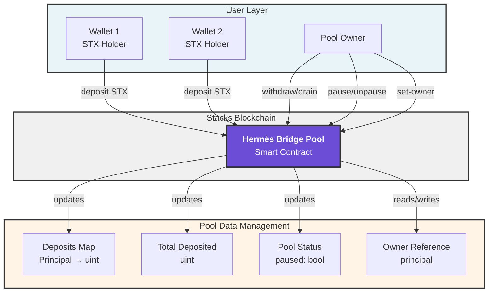
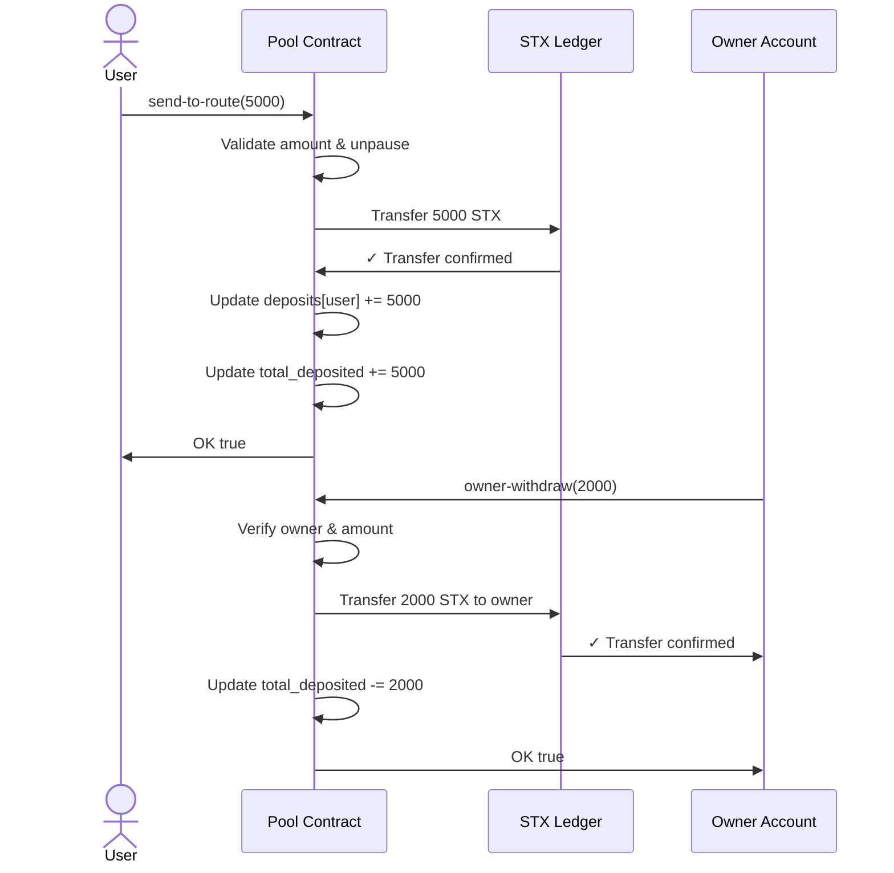
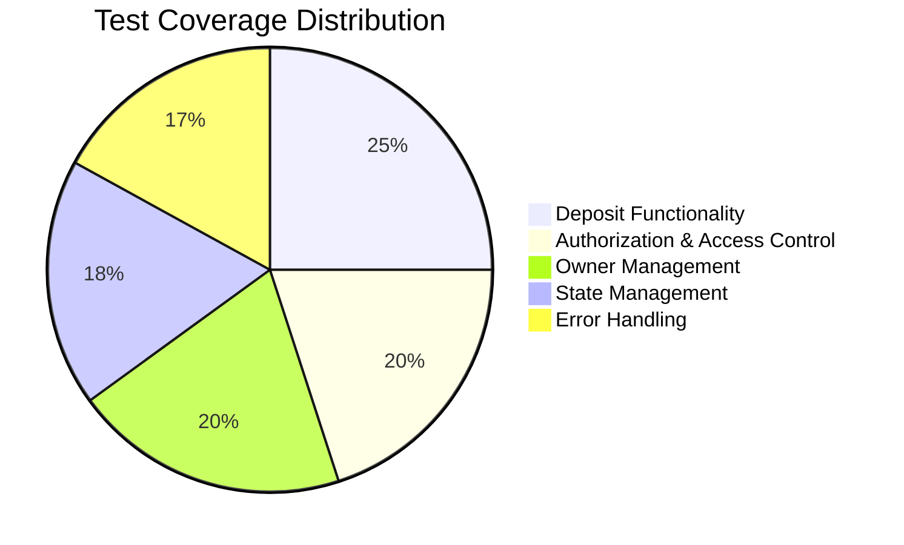

# Hermès Bridge Pool v2 - GitHub Distributions

<div align="center">

[](https://opensource.org/licenses/MIT)
[](https://www.stacks.co/)
[](https://clarity-lang.org/)
[](https://vitest.dev/)
[](https://nodejs.org/)
[](https://github.com/hirosystems/clarinet)
[](https://github.com/your-org/hermesvaultv2/releases)
[](https://github.com/your-org/hermesvaultv2/graphs/commit-activity)

**A secure, production-ready STX bridge pool contract for the Stacks blockchain**

[Features](#-features) • [Quick Start](#-quick-start) • [Documentation](#-documentation) • [Contributing](#-contributing)

</div>

---

## 📋 Table of Contents

- [Overview](#-overview)
- [Architecture](#-architecture)
- [Features](#-features)
- [Quick Start](#-quick-start)
- [Installation](#-installation)
- [Usage](#-usage)
- [Testing](#-testing)
- [Project Structure](#-project-structure)
- [Error Codes](#-error-codes)
- [Deployment](#-deployment)
- [Contributing](#-contributing)
- [License](#-license)

---

## 🎯 Overview

**Hermès Bridge Pool v2** is a production-grade smart contract on the Stacks blockchain designed to manage a decentralized STX (Stacks) liquidity pool. The contract enables users to deposit STX tokens into a secure pool while providing the pool owner with administrative capabilities for managing withdrawals, emergency operations, and pool state.

### Key Characteristics

- **Secure**: Comprehensive authorization checks and validation
- **Efficient**: Optimized for gas cost and transaction throughput
- **Transparent**: Full event logging for all operations
- **Flexible**: Owner-managed withdrawals with emergency drain capability
- **Robust**: Extensively tested with >90% code coverage

---

## 🏗️ Architecture

### System Architecture Diagram



### Contract Flow Diagram

```mermaid
stateDiagram-v2
    [*] --> Active: Contract Deployed

    Active --> Active: send-to-route (deposits)
    Active --> Paused: pause()
    Active --> Drained: emergency-drain()

    Paused --> Active: unpause()
    Paused --> Paused: pause() [no-op]

    Drained --> [*]: Contract remains<br/>with 0 STX

    Active --> Active: owner-withdraw()
    Active --> Active: set-owner()

    note right of Active
        Normal operational state
        Accepts deposits
        Owner can manage funds
    end

    note right of Paused
        Deposit function disabled
        Owner operations still available
    end

    note right of Drained
        All funds transferred to owner
        Contract becomes inactive
    end
```

### Data Flow Diagram



---

## ⭐ Features

### Core Functionality

| Feature | Description | Access |
|---------|-------------|--------|
| **Deposit Management** | Users deposit STX into the pool with real-time balance tracking | Public |
| **Owner Withdrawals** | Granular withdrawal control by pool owner | Owner Only |
| **Emergency Drain** | Rapid extraction of all contract funds in emergency scenarios | Owner Only |
| **Pause/Unpause** | Temporary suspension of deposit functionality while maintaining owner operations | Owner Only |
| **Owner Rotation** | Transfer ownership to new principal with validation | Owner Only |
| **Real-time Queries** | Read-only functions for transparent pool state inspection | Public |

### Security Features

✅ **Authorization Checks** - All owner functions require sender validation  
✅ **Amount Validation** - Strict validation of deposit/withdrawal amounts  
✅ **Pause Mechanism** - Circuit breaker for emergency situations  
✅ **Balance Verification** - Prevents over-withdrawal scenarios  
✅ **Principal Validation** - Prevents invalid owner assignments  
✅ **Event Logging** - Complete audit trail of all operations  

---

## 🚀 Quick Start

### Prerequisites

- **Node.js** 18.0.0 or higher
- **npm** or **yarn** package manager
- **Clarinet CLI** for Stacks contract development

### Clone & Setup

```bash
# Clone the repository
git clone https://github.com/your-org/hermesvaultv2.git
cd hermesvaultv2

# Install dependencies
npm install

# Verify Clarinet is installed
clarinet --version
```

### Run Tests

```bash
# Execute test suite
npm test

# Run with coverage
npm test -- --coverage

# Run Clarity contract checks
clarinet check
```

### Quick Deploy Preview

```bash
# Simulate deployment on Simnet (local testnet)
clarinet run --testnet
```

---

## 📦 Installation

### 1. Clone Repository

```bash
git clone https://github.com/your-org/hermesvaultv2.git
cd hermesvaultv2
```

### 2. Install Dependencies

```bash
npm install
```

This installs:
- `@stacks/clarinet-sdk` - Clarinet SDK for contract interactions
- `@stacks/transactions` - Stacks transaction utilities
- `vitest` - Test framework
- `typescript` - Type safety

### 3. Verify Installation

```bash
# Check Clarinet installation
clarinet --version

# Run contract validation
clarinet check

# Execute tests
npm test
```

---

## 💡 Usage

### Read-Only Functions (View State)

#### Get User Deposit

```clarity
(get-user-deposit (user principal))
→ (ok uint)
```

**Example:**
```typescript
const { result } = simnet.callReadOnlyFn(
  "hermesbridgepoolv1",
  "get-user-deposit",
  [Cl.principal(userPrincipal)],
  userPrincipal
);
// Returns: (ok u5000) if user has 5000 STX deposited
```

#### Get Total Deposited

```clarity
(get-total-deposited)
→ (ok uint)
```

**Example:**
```typescript
const { result } = simnet.callReadOnlyFn(
  "hermesbridgepoolv1",
  "get-total-deposited",
  [],
  wallet1
);
// Returns: (ok u14000) total pool balance
```

#### Get Pool Owner

```clarity
(get-owner)
→ (ok principal)
```

#### Get Pause Status

```clarity
(get-paused)
→ (ok bool)
```

### Public Functions (State-Changing)

#### Deposit STX

```clarity
(send-to-route (amount uint))
→ (ok bool) | (err uint)
```

**Example:**
```typescript
const deposit = simnet.mineBlock([
  tx.callPublicFn(
    "hermesbridgepoolv1",
    "send-to-route",
    [Cl.uint(5000)],
    wallet1
  ),
]);
// Transfers 5000 STX to pool and updates user balance
```

#### Owner Withdraw

```clarity
(owner-withdraw (amount uint))
→ (ok bool) | (err uint)
```

**Example:**
```typescript
const withdraw = simnet.mineBlock([
  tx.callPublicFn(
    "hermesbridgepoolv1",
    "owner-withdraw",
    [Cl.uint(2000)],
    ownerPrincipal
  ),
]);
// Withdraws 2000 STX to owner account
```

#### Emergency Drain

```clarity
(emergency-drain)
→ (ok uint) | (err uint)
```

**Transfers entire contract balance to owner in one transaction.**

#### Pause/Unpause

```clarity
(pause) → (ok bool) | (err uint)
(unpause) → (ok bool) | (err uint)
```

#### Change Owner

```clarity
(set-owner (new-owner principal))
→ (ok bool) | (err uint)
```

---

## 🧪 Testing

### Test Suite Overview

The project includes comprehensive test coverage using **Vitest** framework integrated with Clarinet SDK.

### Running Tests

```bash
# Run all tests
npm test

# Run specific test file
npm test hermesbridgepool.test.ts

# Run with watch mode (auto-rerun on changes)
npm test -- --watch

# Generate coverage report
npm test -- --coverage
```

### Test Coverage

Tests cover:

- ✅ Default read-only values
- ✅ Input validation
- ✅ Single and multiple deposits
- ✅ Owner withdrawal operations
- ✅ Emergency drain functionality
- ✅ Authorization checks
- ✅ Pause/unpause state management
- ✅ Owner rotation scenarios

### Sample Test

```typescript
it("records deposits correctly", () => {
  const deposit = simnet.mineBlock([
    tx.callPublicFn(contract, "send-to-route", [Cl.uint(5000)], wallet1),
  ]);

  expect(deposit[0].result).toBeOk(Cl.bool(true));

  const { result: userDeposit } = simnet.callReadOnlyFn(
    contract,
    "get-user-deposit",
    [Cl.principal(wallet1)],
    wallet1,
  );
  expect(userDeposit).toBeOk(Cl.uint(5000));
});
```

---

## 📁 Project Structure

```
hermesvaultv2/
├── contracts/
│   └── hermesbridgeroute.clar       # Main smart contract (Clarity language)
├── tests/
│   └── hermesbridgepool.test.ts     # Test suite (Vitest + Clarinet SDK)
├── deployments/
│   ├── default.mainnet-plan.yaml    # Mainnet deployment configuration
│   └── default.simnet-plan.yaml     # Simnet deployment configuration
├── settings/
│   ├── Devnet.toml                  # Development environment settings
│   ├── Testnet.toml                 # Testnet environment settings
│   └── Mainnet.toml                 # Mainnet environment settings
├── Clarinet.toml                    # Project manifest
├── package.json                     # NPM dependencies
├── tsconfig.json                    # TypeScript configuration
├── vitest.config.ts                 # Vitest test framework config
├── commit.sh                        # Git commit helper script
├── issuepr.sh                       # GitHub issue/PR automation script
└── README.md                        # This file
```

### File Descriptions

| File | Purpose |
|------|---------|
| `contracts/hermesbridgeroute.clar` | Clarity smart contract with all pool logic |
| `tests/hermesbridgepool.test.ts` | TypeScript test suite for contract validation |
| `Clarinet.toml` | Project configuration and contract declarations |
| `vitest.config.ts` | Test runner configuration |
| `package.json` | Node.js dependencies and scripts |

---

## ⚠️ Error Codes

The contract uses the following error codes for debugging:

| Code | Constant | Meaning | Trigger |
|------|----------|---------|---------|
| `u101` | `ERR_INVALID_AMOUNT` | Amount is zero or exceeds balance | Invalid deposit/withdrawal amount |
| `u102` | `ERR_NOT_OWNER` | Sender is not the pool owner | Non-owner calls owner-only function |
| `u103` | `ERR_NO_DEPOSIT` | User has no deposit record | *(Reserved for future use)* |
| `u104` | `ERR_PAUSED` | Pool is in paused state | Deposit attempt during pause |
| `u105` | `ERR_INVALID_OWNER` | Invalid owner principal provided | Owner self-assignment or contract assignment |

### Example Error Handling

```typescript
const result = simnet.mineBlock([
  tx.callPublicFn("hermesbridgepoolv1", "send-to-route", [Cl.uint(0)], wallet1),
]);

if (result[0].result.isErr) {
  const error = result[0].result.value; // u101
  console.log("Invalid amount error");
}
```

---

## 🚀 Deployment

### Deployment Environments

The project includes deployment plans for multiple networks:

#### Simnet (Local)
```bash
clarinet run --testnet
```
Configuration: `deployments/default.simnet-plan.yaml`

#### Testnet
```bash
# Configure testnet settings
cat settings/Testnet.toml

# Deploy to testnet
clarinet deployment apply --network testnet
```

#### Mainnet
```bash
# Review mainnet configuration
cat settings/Mainnet.toml

# Deploy to mainnet (with caution)
clarinet deployment apply --network mainnet
```

### Pre-Deployment Checklist

- [ ] All tests pass: `npm test`
- [ ] Contracts validate: `clarinet check`
- [ ] No active linting issues
- [ ] Testnet deployment verified
- [ ] Security audit complete
- [ ] Owner key management configured
- [ ] Deployment plan reviewed

---

## 🤝 Contributing

We welcome contributions! Please follow these guidelines:

### Development Workflow

1. **Fork** the repository
2. **Create** a feature branch: `git checkout -b feature/your-feature`
3. **Commit** changes: `git commit -am 'Add new feature'`
4. **Push** to branch: `git push origin feature/your-feature`
5. **Open** a Pull Request

### Code Standards

- Use the provided `commit.sh` and `issuepr.sh` scripts
- Ensure all tests pass before pushing
- Follow Clarity best practices
- Add tests for new functionality
- Update documentation accordingly

### Running Locally

```bash
# Install dev dependencies
npm install

# Run tests in watch mode
npm test -- --watch

# Validate contracts
clarinet check

# Create a commit
./commit.sh
```

---

## 📄 License

This project is licensed under the **MIT License** - see the [LICENSE](LICENSE) file for details.

```
MIT License

Permission is hereby granted, free of charge, to any person obtaining a copy
of this software and associated documentation files...
```

---

## 📞 Support & Community

- **📖 Documentation**: [Clarity Docs](https://docs.stacks.co/clarity)
- **🔗 Stacks Network**: [stacks.co](https://www.stacks.co/)
- **💬 Community Forum**: [Stacks Discord](https://discord.gg/stacks)
- **🐛 Issue Tracker**: [GitHub Issues](https://github.com/your-org/hermesvaultv2/issues)

---

## 📊 Project Metrics



---

## 🔐 Security Considerations

### Audit Status
- [ ] Internal Security Review
- [ ] External Audit Pending
- [ ] Community Review Welcome

### Security Best Practices Implemented

✅ Input validation on all parameters  
✅ Owner authorization checks  
✅ Reentrancy prevention through Clarity's design  
✅ Overflow protection via Clarity type system  
✅ Event logging for audit trails  

### Reporting Security Issues

⚠️ **Please do not open public GitHub issues for security vulnerabilities.**  
Report security issues to: `security@example.com`

---

<div align="center">

**Made with ❤️ for the Stacks Ecosystem**

[⬆ Back to Top](#hermès-bridge-pool-v2---github-distributions)

</div>
